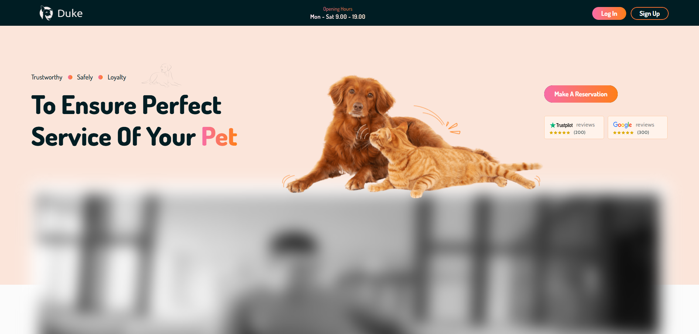

# Pet Customer Portal

A modern customer portal for pet owners to manage appointments, daycare reservations, boarding services, grooming, payments, and pet information.

Built with **React**, **Vite**, and modern web technologies, the portal provides an intuitive experience for customers while integrating seamlessly with the Sunshine Pet Management System.

---

## Features

* 🐶 Customer Registration & Authentication
* 📅 Book Boarding Appointments
* 🛁 Schedule Grooming Services
* 🏡 Reserve Daycare Services
* 🐾 Manage Pet Profiles
* 💉 View Vaccination Records
* 📋 Appointment History
* 💳 Secure Online Payments (Stripe Integration)
* 🔔 Appointment Status & Notifications
* 📱 Responsive UI for Desktop & Mobile

---

## Tech Stack

* React
* Vite
* JavaScript (ES6+)
* React Router
* Axios
* CSS
* Stripe
* REST API

---

## Project Structure

```
src/
├── assets/
├── components/
├── layouts/
├── pages/
├── routes/
├── services/
├── utils/
└── App.jsx
```

---

## Installation

Clone the repository:

```bash
git clone https://github.com/techsavvy87/Sunshine-customer.git
```

Navigate to the project:

```bash
cd Sunshine-customer
```

Install dependencies:

```bash
npm install
```

Start the development server:

```bash
npm run dev
```

Build for production:

```bash
npm run build
```

Preview the production build:

```bash
npm run preview
```

---

## Backend

This project communicates with the Sunshine Pet Management backend through REST APIs for:

* Authentication
* Customer Management
* Pet Management
* Appointment Booking
* Boarding
* Daycare
* Grooming
* Payments
* Notifications

---

## Security

* Secure Authentication
* Protected Routes
* API Token Authentication
* Stripe Payment Security

---

## Screenshots

### Home


